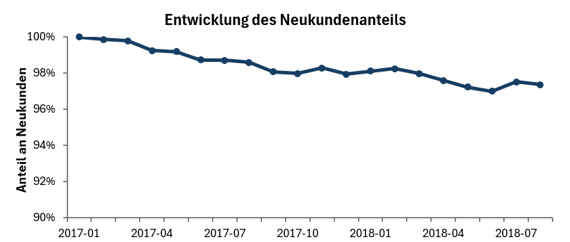
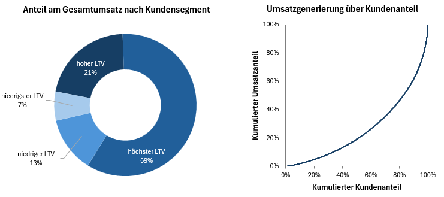
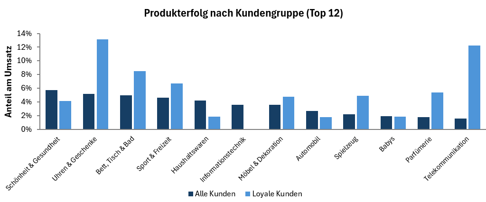

# Analyse und -segmentierung der Kunden eines Online-Shops

## Inhalt

[Hintergrund und Übersicht](#hintergrund-und-übersicht)

[Datenstruktur](#datenstruktur)

[Kurzzusammenfassung](#kurzzusammenfassung)

[Detaillierte Analyseergebnisse](#detaillierte-analyseergebnisse)

[Empfehlungen](#empfehlungen)

[Technische Details](#technische-details)
   

## Hintergrund und Übersicht
Olist ist ein 2015 gegründetes brasilianisches E-Commerce-Unternehmen, das über seine Webseite und App Kunden mit Anbietern einer breiten Spannweite an Produkten verbindet.

Für die Jahre 2017-2018 stellt das Unternehmen umfangreiche Daten zu Transaktionen und Kunden bereit. Diese Daten ermöglichen es, fundierte Kenntnisse über den Kundenstamm und dessen Entwicklung im Zeitverlauf zu gewinnen. Die Analyse schafft eine datenbasierte Grunlage um strategische Entscheidungen zu treffen, die auf die Kundenbasis angepasst sind.

Das Projekt bietet Erkenntnise und Empfehlungen zu den folgenden Bereichen der Kundenanalyse:
- Wie hat sich Kundenzahl und Umsatz über die Zeit entwickelt und sowie die Entwicklung der Neukundenaquise (Kaufverhalten und wiederkehrende Kunden)

- Wer sind die wertvollsten Kunden (nach Recency, Frequency und Monetary Value) und was macht diese Gruppen aus?

- Wie ist die Kundenbindung und -abwanderung über die Zeit?
   

Die SQL-Abfragen zur Überprüfung der Datenqualität und Datenbereinigung können [hier](/Skripte/Qualitätskontrolle%20Daten.sql) eingesehen werden.  
Die zur Beantwortung der Analysefragen genutzten SQL-Abfragen können [hier](/Skripte/) eingesehen werden.  
Eine Ausführung der genutzten Kenntnisse ist [hier](#technische-details) zu finden.
   

## Datenstruktur
Das Unternehmen stellt einen umfangreichen Datensatz bereit, der Informationen zu Kunden, Transaktionen, Zulieferern und Produkten in insgesamt 9 Tabellen enthält. Der Datensatz umfasst 99441 Bestellungen. 

Im Zentrum der Analyse stehen dabei insbesondere:
- `order_dataset`: Enthält Transaktionendaten wie Bestellstatus und Bestelldatum.

- `order_items_dataset`: Beinhaltet Informationen zu bestellten Produkten wie Preis und Versandkosten.

- `customers_dataset`: Enthält Daten zu Kunden wie individuelle Kunden-ID und Herkunft.

- `products_dataset`: Beinhaltet Produktinformationen wie Kategorie und -abmessung.
   

   
Vor Beginn der Analyse wurde die Datenqualität überprüft und identifizierte Probleme gelöst und dokumentiert. Die dafür verwendeten SQL-Abfragen können [hier](/Skripte/Qualitätskontrolle%20Daten.sql) nachgelesen, während die Problemdokumentation [hier](/Bilder/Datenqualitätsprotokoll.png) einsehbar ist.
   

## Kurzzusammenfassung
Olist verzeichnete von 2017 bis 2018 ein starkes Volumenwachstum, bei dem die Kundenanzahl und der Umsatz fast verzehnfacht wurde. Dieses Wachstum wird jedoch fast vollständig durch Neukunden getragen, die jeden Monat über 90% des Umsatzes generieren. Es zeigt sich zudem ein dominanter Churn: 97% der Kunden kaufen nur einmal bei Olist und die Kundenbindungsrate ist über die Kohorten weiter gesunken. Im Gegensatz zu Umsatz und Kundenzahl ist die Profitabilität der Kunden (AOV und ARPC) bei ca. 160R$ stagniert, da der gewonnene Umsatz fast ausschließlich in Erstkäufen erwirtschaftet wird.

Die folgenden Abschnitte untersuchen die Struktur von Olists Kundenbasis im Detail, um die historische Kundenentwicklung, die Kundenzusammensetzung sowie die Bindung der Kunden genauer nachzuvollziehen.  
   

## Detaillierte Analyseergebnisse

### Historische Kundenentwicklung

Um die Entwicklung des Kundenstammts über die Zeit nachzuvollziehen, wurden folgende Aspekte analysiert:
- Wachstum von Umsatz und individueller Kundenzahl
- Analyse von Neukunden und Umsatzanteilen
- Entwicklung von Maßzahlen der Profitabilität wie durchschnittlicher Einkaufswert (AOV) und Gesamtumsatz pro Kunde (ARPC)

 Die für die Analyse genutzten SQL-Abfragen können [hier](/Skripte/Kundenentwicklung%20über%20die%20Zeit.sql) eingesehen werden.

#### Zentrale Erkenntnisse
- **Volumenwachstum:** Im betrachteten Zeitraum hat das Unternehmen ein starkes Wachstum in allen untersuchten Metriken erlebt. Die monatliche Kundenzahl hat sich von 718 im Januar 2017 auf 6310 im August 2018 fast verzehnfacht und der monatliche Umsatz ist im gleichen Zeitraum von 127000R$ auf 985000R$ gestiegen. Im Jahresvergleich sind die Werte in 2018 durchgängig höher, wobei sich der Wachstumstrend abgeschwächt hat. Dabei gibt es im November einen deutlichen Peak (7183 Kunden und 1.1,2 Mio R$ Umsatz), der eine erfolgreiche Black Friday Aktion zeigt.

- **Zurückbleiben der Profitabilität**: Während das Unternehmen im Volumen stark gewachsen ist, zeigt der durchschnittliche Bestellwert pro Kunde (AOV) sowie der durchschnittliche Gesamtumsatz pro Kunde (ARPC) über den gesamten Zeitraum stagnierende bis leicht rückläufige Werte. Beide Profitabilitätswerte liegen im Bereich von 160R$ - 170R$ und liegen zudem aufgrund niedriger Kauffrequenz sehr nah beieinander. Besonders zum Ende 2017 (AOV 152R$) und im aktuellesten Monat (AOV 155R$) sind die Werte gesunken. Der Fokus liegt also aktuell auf Wachstum und nicht auf Wertsteigerung der Kunden.

- **Dominanz der Neukunden**: Das Wachstum im Umsatz wird in jedem Monat zu ca 90% durch Neukunden erwirtschaftet. Obwohl der Anteil an Neukunden leicht sinkt, waren im aktuellsten Monat immer 97% der aktiven Kunden Neukunden. Das Unternehmen ist also erfolgreich in Neukundenakquise, muss aber hohe Ressourcen einsetzen, um jeden Monat fast seine gesamte Kundenbasis neu zu gewinnen. Die Wertigkeit der Bestandskunden des Unternehmens zeigt sich außerdem darin, dass ein Bestandskunde monatlich mehr Geld ausgibt als ein Neukunde.
   

   

### Kundensegmentierung nach RFM
Die Zusammensetzung des Kundenstamms wurde genauer analysiert, indem die Kunden anhand folgender Aspekte segmentiert und untersucht wurden:
- Analyse der inaktiven Tage pro Kunden (Recency)
- Analyse der Kauffrequenz (Frequency)
- Analyse des Gesamtumsatzes pro Kunde (Monetary Value)
- Vergleich der Kundensegmente nach gekauften Produkten und Herkunft

Die für die Beantwortung dieser Fragen durchgeführten SQL-Abfragen können [hier](/Skripte/Kundensegmentierung.sql) eingesehen werden.

#### Zentrale Erkenntnisse
- **Überwiegend Einmalkäufer**: Die Kundenbasis von Olist ist durch eine extreme Loyalitätslücke gekennzeichnet: Rund 97% der Kunden tätigen nur einen einzigen Kauf. Weniger als 1% der Kunden kauft mehr als zweimal. Die durchschnittliche monatliche Kauffrequenz ist in der gesamten Historie leicht von einem Spitzenwert von 1,045 auf 1,006 Käufe pro Monat gesunken, was die Herausforderung der Kundenbindung (siehe nächster Abschnitt) verdeutlicht.

- **Reaktivierung der Kunden**: Durch die niedrige Kauffrequenz sind die meisten Kunden seit ihrem ersten Kauf inaktiv. Knapp 90% der Kundenbasis haben seit über 100 Tagen keinen Kauf mehr getätigt, bei einer durchschnittlichen Inaktivität von 285 Tagen. Die größte Gruppe, bestehend aus 11.798 Kunden, befindet sich in einer kritischen Inaktivitätsphase von 150 bis 200 Tagen, die Reaktivierungspotential bildet.

- **Finanzielle Stabilität**: Der durchschnittliche Customer Lifetime Value (LTV) über alle Käufe hinweg liegt bei 165 R$. Rund 80% der Kunden haben einen LTV von unter 200 R$, wobei die Verteilung durch wenige Ausreißer mit einem LTV von bis zu 13.500 R$ nach oben verzerrt wird. Die Umsatzgenerierung ist ungleich über die Kunden hinweg verteilt: Die oberen 25% der Kunden sind für 60% des Gesamtumsatzes verantwortlich, während die untere Hälfte etwa 20% beisteuert. Während es also eine Konzentration der Umsatzgenerierung gibt, ist die Ungleichheit ist jedoch moderat, sodass der Erfolg nicht von einer extrem kleinen Gruppe abhängt.
   

   
- **Loyalitäts-Treiber**: Der Aufbau von Kundenloyalität wird von spezifischen Kategorien getragen: Modezubehör wird von loyalen Kunden mit einer 1,8-fach höheren Frequenz gekauft und liefert den 11-fachen Umsatzbeitrag. Auch Bett, Tisch und Bad, die beliebteste Kategorie, ist ein wichtiger Frequenzgeber und liefert 1,7-mal so viel Umsatz bei Wiederholungskäufern. Für die Umsatzmaximierung bei loyalen Kunden sind Uhren & Geschenke (13% Umsatzanteil bei Wiederholungskunden) und Telekommunikation (Umsatzanteil steigt von 2% auf 12%) entscheidend. Hier wird seltener, aber teurere Produkte gekauft. Produkte der Kategorie Schönheit und Gesundheit scheinen eher vom Zweitkauf abzuhalten und machen ihn um 20% unwahrscheinlicher mit weniger Umsatz. In der regionalen Herkunft unterscheiden sich die Kundengruppen kaum.
   

   

### Kundenbindung und -abwanderung
Die Analyse der Kauffrequenz und Inaktivität hat bereits gezeigt, dass viele Kunden nur einmal bei Olist kaufen. Um die Kundenbindung genauer zu untersuchen, wurden folgende Analysen durchgeführt: 
- Aufteilung in Kohorten nach Quartal des ersten Kaufs
- Abwanderung der Kohorten über die Zeit und insgesamt
- Analyse des aktuellen Risikostatus der Kundenbasis

Die für diese Analysen durchgeführten SQL-Abfragen können [hier](/Skripte/Kundenbindung%20und%20Abwanderung.sql) eingesehen werden.

#### Zentrale Erkenntnisse
- **Abflachender Umsatz**: Der Umsatz im Akquisequartal (relatives Quartal 0) ist über die Kundenkohorten hinweg stetig gestiegen und erreichte in Q2 2018 einen Peak von 3.2 Mio R$ Allerdings bricht der Umsatz in den Folgequartalen aufgrund des hohen Anteils an Einmalkäufern massiv ein. In allen Kohorten wird in den Folgequartalen nur noch 1-4% des Gesamtumsatzes der Kohorte erzielt, mit sinkender Tendenz über die Zeit. Während das erste Folgequartal der Kohorte Q1 2017 noch 0,9% des Umsatzes (7.500R$) ausmacht, sind es in Q2 2018 nur noch 0,4% (12.176 R$).

- **Sinkende Bindung über Kohorten**: Die Kunden von Olist bestehen nicht nur fast ausschließlich aus Einmalkäuftern, die Kundenbindungsrate ist auch über die Zeit gesunken. Während 3% der Kunden aus der Kohorte Q1 2017 erneut kauften, sank dieser Prozentsatz für die Kohorte Q2 2018 auf nur 0,5%. Dieser negative Trend bei der Kundenbindung ist besonders seit der Kohorte Q4 2017 zu beobachten. Eventuell ist dies auf eine hohe Zahl neu gewonnener Kunden im November 2017 zurückzuführen, die aber nicht gebunden werden konnten. 

- **Dominanter Churn**: Ein Großteil der Kundenbasis ist bereits abgewandert oder gefährted. 65% der Kunden sind mit über 6 Monaten ohne Aktivität abgewandert, während 18% der Kundenbasis, also 18.000 Kunden mit zwischen 3 und 6 Monaten Inaktivität Gefahr laufen, ebenfalls abzuwandern. Da die 70% der Wiederholungskäufe innerhalb der ersten 150 Tage nach dem Erstkauf erfolgen, ist dieser Zeitraum kritisch. Um aktive Kunden zu halten, sind besonders die ersten 50 Tage entscheidend, in denen allein 40% der Zweitkäufe erfolgen.
   

   

## Empfehlungen
Aus den Analyseergebnissen lassen sich folgende zentrale Handlungsempfehlungen ableiten:

- **Frequenzsteigerung und Kundenbindung**: Die höchste Priorität sollte auf der Konvertierung von Erst- zu Zweitkäufern liegen, um die Loyalitätslücke (97% Einmalkäufer) zu schließen und die Kosten für Neukundenakquise zu senken. Aktuell befinden sich ca. 12.000 Kunden in einem für die Reaktivierung kritischen Zeitfenster von 150 inaktiven Tagen. Um diese Kundenbasis zu halten und zu Wiederholungskäufen zu motivieren, sollten Anreize zum Zweitkauf gesetzt werden. Bei Wiederholungskäufern beliebte Produkte aus den Kategorien Modezubehör und Bett, Tisch und Bad eignen sich optimal für Sonderangebote an Neukunden, insbesondere nach Aktionen mit hohem Neukundenanteil wie dem Black Friday. 

- **Wertsteigerung**: Um die stagnierende Profitabilität (AOV/ARPC bei ~160 R$) zu verbessern, sollte der Wert bereits gebundenen Kunden gezielt erhöht werden, indem zum vorherigen Kauf komplementäre oder höherpreiseige Produkte angeboten werden. Die Kategorien Uhren & Geschenke und Telekommunikation sind hierfür gut geeignet, da sie durch höherpreisige Käufe überproportional zum Umsatz von Wiederholungskunden beitragen. Hierfür sollten Upselling-Pfade mit  personalisierten Kampagnen (z.B. komplementäre Produkte) für Bestandskunden entwickelt werden.

- **Akquisestrategie**: Ansichsts der sinkenden Bindungsrate über die Kohorten und der Konzentration des Umsatzes auf die oberen 25% der Kunden wäre eine Überprüfung der Akquisekanäle zu empfehlen. Neukunden-Kampagnen sollten auf jene Segmente und Kanäle ausgerichtet werden, die historisch Kunden mit höherem Bestellwert (über 165 R$) zusammenhängen oder einer höheren Konversionswahrscheinlichkeit zum Zweitkauf liefern.

- **Ursachsenanalyse (Nächster Schritt)**: Da 97% der Kunden von Olist keinen zweiten Kauf tätigen, liegt die Vermutung nahe, dass die Kunden mit der gebotenen Leistung nicht zufrieden waren. Ein weiteres Projekt widmet sich daher der Analyse der Kundenbewertung sowie der Testung spezifischer Hypothesen zu den Ursachen der hohen Abwanderung. Die Ergebnisse dieser Analyse werden nach der Durchführung hier verlinkt.

   

## Technische Details
Zur Beantwortung der Analysefragen wurde PostgreSQL in der Umgebung DBeaver sowie Excel verwendet.

### Genutzte Kenntnisse
- **Überprüfung von Datenqualität:**  Identifikation und Dokumentation typischer Probleme wie inkonsistenter Formate oder fehlender Werte.

- **Datenbereinigung und -modellierung:** Imputation fehlender Daten, Korrekur von Formaten mit `L-PAD` sowie Aufbau des Datenmodells mit Composite Keys und Foreign Keys.

- **Analyse historischer Trends:** Monatliche und kohortenbasierte Analyse von Kennzahlen mit `DATE_TRUNC`, Untersuchung wiederholter Käufe mithilfe von Window-Funktionen wie `ROW_NUMBER` und CTEs.  

- **Segmentierung in Gruppen:** Erstellung eines Views mit nach Quartilen segmentierten Kundengruppen durch `PERCENTILE_CONT` und `CASE`, anschließende Analyse der Segmente mithilfe einer Faktentabelle (`JOIN`) zur höheren Effizienz.

- **Datenvisualisierung mit Excel:** Import von Ergebnistabellen und Visualisierung zentraler Erkenntnisse zur schnellen Einsicht.
   

Die im Projekt verwendeten Daten sind echte Unternehmensdaten der E-Commerce Firma Olist aus Brasilien, die [öffentlich](https://www.kaggle.com/datasets/olistbr/brazilian-ecommerce/) zur Verfügung gestellt wurden.